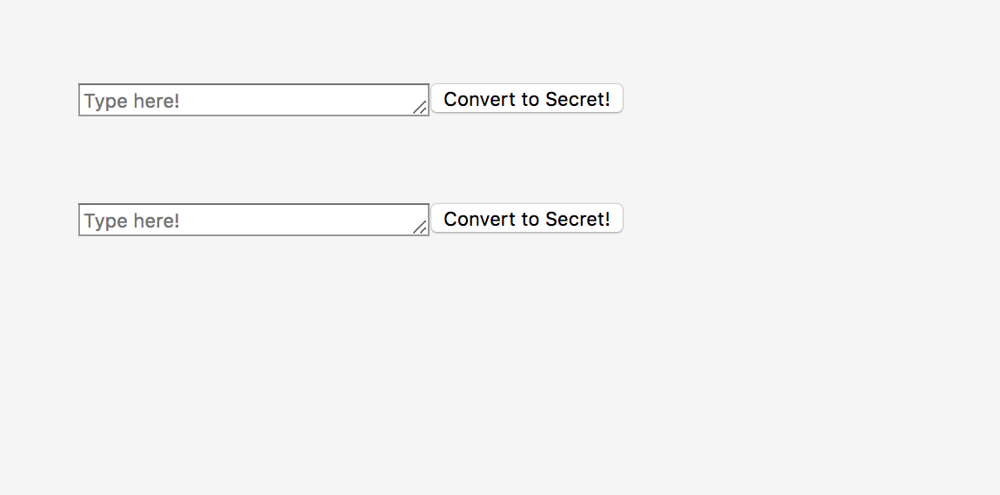
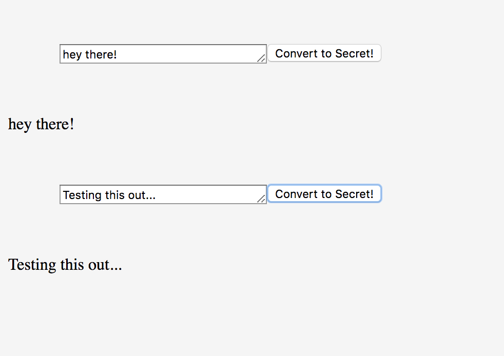

# code-maker-breaker

This is a quiz to test my knowledge!m You have been tasked to make an app that will take text and encode it into a secret. Your app should also be able to decode secrets that are entered.

## Screenshots



## Technical Requirements

* Github project with cards
* Cards should be by feature
* Each card should have its own branch and follow the correct git branching process
* Re-usable functions
* Functions follow single responsibility principle
* Clean code - proper indentation, comments as needed, no console.logs after merging

## How to run this project
* Use npm to install http-server in your terminal: 
```sh
npm install -g http-server
```
* Run the server
```sh
hs -p 9999
```
* Open chrome and navigate to: 
```
localhost: 9999
```